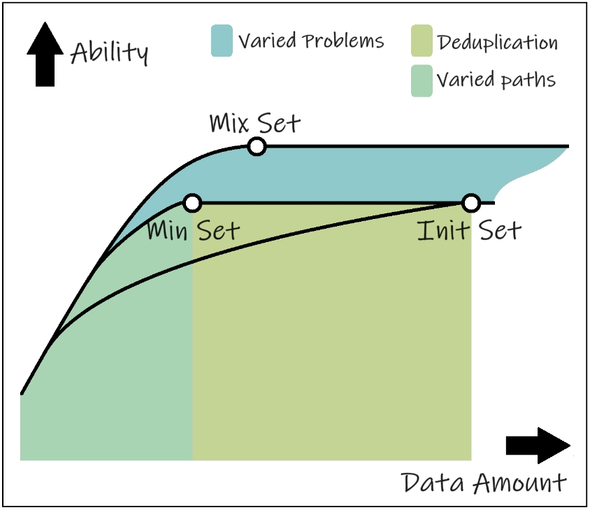

# MMOS

## 🔥 News
<!-- - [2024/2/26]  -->
- ✅ Dataset release
- 🔲 Models release 
- 🔲 Arxiv will coming soon! 

<!-- - [2024/1/12] Models ZZ-Math 7B released at [Google Drive](https://drive.google.com/drive/folders/13tpLR0bNLLg1oLkjUuwJT8STCB10uSSS?usp=sharing) or [Quark](https://pan.quark.cn/s/0b69ec84c793) 
- [2024/1/11] Dataset released at [😊 HuggingFace](https://huggingface.co/datasets/cyzhh/TAL-SCQ-CN_mix) -->

## 💡 Introductions

| Model         | GSM8K 7B | SVAMP 7B | ASDiv 7B | MATH 7B | GSM8K 13B | SVAMP 13B | ASDiv 13B | MATH 13B |
|---------------|----------|----------|----------|---------|-----------|-----------|-----------|----------|
| LLAMA-2       | 13.3     | 38.0     | 50.7     | 4.1     | 24.3      | 43.1      | 56.3      | 6.3      |
| LLAMA-2 SFT   | 41.3     | 31.9     | 47.4     | 7.2     | 51.1      | 46.3      | 58.6      | 9.2      |
| LLAMA-2 RFT   | 50.3     | -        | -        | -       | -         | -         | -         | -        |
| WizardMath    | 54.9     | 57.3     | 59.1     | 10.7    | 63.9      | 64.3      | 65.8      | 14.0     |
| MAMMOTH       | 53.6     | 67.7     | 31.5     | -       | 62.0      | 72.4      | -         | 34.2     |
| MetaMath      | 66.5     | -        | -        | 19.8    | 72.3      | -         | -         | 22.4     |
| MathCoder-L   | 64.2     | 71.5     | -        | 23.3    | 72.6      | 76.9      | -         | 29.9     |
| MathCoder-CL  | 67.8     | 70.7     | -        | 30.2    | 74.1      | 78.0      | -         | 35.9     |
| TORA          | 68.8     | 68.2     | 73.9     | 40.1    | 72.7      | 72.9      | 77.2      | 43.0     |
| TORA-CODE     | 72.6     | 70.4     | **78.7**     | **44.6**    | 75.8      | 75.7      | 81.4      | 48.1     |
| **MMOS**          | 69.9     | 73.4     | 76.8     | 40.2    | 74.8      | 77.0      | 80.0      | 43.2     |
| **MMOS-CODE**     | **73.9**     | **76.4**     | 78.6     | 44.3    | **77.1**      | **77.5**      | **81.9**      | **48.1**     |
| **MMOS-MinCODE**  | 70.3     | 72.5     | 76.7     | 44.6    | -         | -         | -         | -        |

## 💾 Install

    git clone https://github.com/cyzhh/MMOS.git
    cd MMOS
    conda create -n MMOS python=3.10 
    conda activate MMOS
    pip install -r requirements.txt

## 📚 Dataset

We use [ToRA](https://github.com/microsoft/ToRA?tab=readme-ov-file) series to generate QA-pairs from open source dataset GSM8K, MATH, TAL-SCQ. The QA-pairs are processed by our algorithm, resulting in the dataset `MMOS`.

The DATA, which we publish at [😊 HuggingFace](https://huggingface.co/datasets/cyzhh/MMOS), need to be placed under the relative path, `./train_data/MMOS/`.

If you are interested in our work, we will publish details about the data processing aspects after the paper is published.

## ⚙️ Auto Problem Generator

You can generate a data set for testing the numerical robustness of model performance by executing the following script command：

    bash scripts/generate.sh
    bash scripts/attack.sh
    bash scripts/rerank.sh

## 🚀 Training
Due to resource constraints, we performed supervised fine-tuning on [CodeLLaMA 7B](https://huggingface.co/codellama/CodeLlama-7b-Python-hf), [CodeLLaMA 13B](https://huggingface.co/codellama/CodeLlama-13b-Python-hf) and [CodeLLaMA 34B](https://huggingface.co/codellama/CodeLlama-34b-Python-hf) using our dataset on A100 40G GPUs. To reproduce our work from CodeLLaMA 7B/13B, you can train according to the following instruction. You can also train the 34B model through DDP script instructions.

    bash scripts/train_single.sh codellama 7b
    bash scripts/train.sh codellama 34b

## 💻 Inference

    bash scripts/infer.sh

## 😇 Acknowledgements

- [ToRA](https://github.com/microsoft/ToRA?tab=readme-ov-file)

## 🌟Star History

